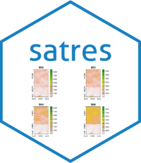

<!-- README.md is generated from README.Rmd. Please edit that file -->

# satres <a href="https://josesamos.github.io/satres/"></a>

<!-- badges: start -->

[](https://CRAN.R-project.org/package=satres)
[](https://github.com/josesamos/satres/actions/workflows/R-CMD-check.yaml)
[](https://www.r-pkg.org:443/pkg/satres)
[](https://app.codecov.io/gh/josesamos/satres?branch=master)
<!-- badges: end -->

We frequently download files with satellite bands from the
[*ESA*](https://dataspace.copernicus.eu/) and
[*USGS*](https://glovis.usgs.gov/) websites to perform data analysis,
transform them or store them in DBMS. They are downloaded as files in
ZIP or TAR format. In some cases, it is necessary to download several
files that cover the study area, so the first operation to perform is to
merge the bands. To access the bands we have to explicitly indicate the
name and location of their files.

The goal of `satres` (*sat*ellite spectral and spatial *res*olution) is
to partially automate these operations. It is enough to indicate the
folder that contains the decompressed files: Satellite bands are
automatically obtained by name (spectral) and spatial resolution; if we
have several files to cover a geographical area, the corresponding bands
are automatically merged. The result can be stored on disk and can also
be obtained as objects of class `SpatRaster`, from package
[`terra`](https://CRAN.R-project.org/package=terra).

Currently supports files obtained from the following sources and
characteristics:

- *Landsat 8-9 OLI/TIRS C2 L1* (Landsat 8-9 Operational Land Imager and
  Thermal Infrared Sensor Collection 2 Level-1).

- *Landsat 7 ETM+ C2 L1* (Landsat 7 Enhanced Thematic Mapper Plus
  Collection 2 Level-1).

- *Landsat 4-5 TM C2 L1* (Landsat 4-5 Thematic Mapper Collection 2
  Level-1).

- *Sentinel-2 MSI S2MSI1C* (Sentinel-2 Multi Spectral Instrument
  Level-1C).

- *Sentinel-2 MSI S2MSI2A* (Sentinel-2 Multi Spectral Instrument
  Level-2A).

## Installation

You can install the released version of `satres` from
[CRAN](https://CRAN.R-project.org) with:

``` r
install.packages("satres")
```

And the development version from [GitHub](https://github.com/) with:

<!-- You can install the development version from [GitHub](https://github.com/) with: -->

``` r
devtools::install_github("josesamos/satres")
```

## Example

To cover the area of the municipality of Lanjarón in Granada (Spain), we
have downloaded two satellite band files from the
[*ESA*](https://dataspace.copernicus.eu/) website.

- `S2A_MSIL2A_20230905T105621_N0509_R094_T30SVF_20230905T170700.zip`:
  0.91 GB
- `S2A_MSIL2A_20230905T105621_N0509_R094_T30SVG_20230905T170700.zip`:
  1.14 GB

We have unzipped them directly into a folder, creating two subfolders.
Additionally, we have selected and transformed the original raster
files, grouping them using the `terra::aggregate()` function with a
factor of 100, to reduce their size so they can be included in the
package. The result is the following folders:

- `esa/f`: 751 KB
- `esa/g`: 842 KB

To merge the satellite bands corresponding to the same geographical area
(tiles) and classify them according to their spatial resolution, we only
have to create an object of the `satres` class. We pass as a parameter
the folder where the files are located.

``` r
esa <- system.file("extdata", "esa", package = "satres")
sr <- satres(dir = esa)
```

Next we consult the spatial resolution of the result (remember that we
have changed the resolution, adding it by a factor of 100).

``` r
sr |>
  get_spatial_resolution()
#> [1] "r1000m" "r2000m" "r6000m"
```

We obtain an object of class `SpatRaster` from the `terra` package with
all the bands of the indicated spatial resolution.

``` r
b <- sr |>
  as_SpatRaster("r1000m")
```

To show the available bands, we represent them graphically below.

``` r
terra::plot(b)
```


The bands are directly accessible by name (*B02*, *B03*, *B04* and *B08*
in the figure), within each object obtained in the result.
